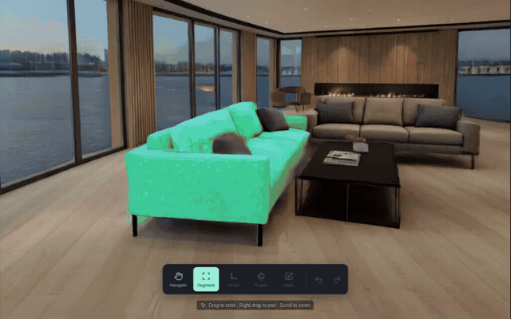

# Marble Studio

Turn World Labs Marble scenes into editable objects. Select furniture inside a generated room, then move, rotate, scale, or delete the original scene geometry.

[](https://github.com/npow/marble-scene-editor/blob/main/public/demo/marble-studio-2min-narrated.mp4)

**[Watch the 2-minute demo with narration](public/demo/marble-studio-2min-narrated.mp4)** · [Captioned version without audio](public/demo/marble-studio-2min.mp4)

The demo starts with the working editor and shows sixteen edits across eight objects in four rooms, followed by the method, challenges, and technology. The footage comes from the running app; the montage replays recorded motions. Narration uses a generic synthetic voice.

## The problem and interaction loop

Generated rooms look realistic, but furniture is embedded in one scene. Marble Studio lets you separate selected geometry into objects you can edit.

**Import → select and refine → create object → move / rotate / scale / delete → undo or save.**

Drag a box around an object. SAM 2 finds its outline, and distance checks reduce accidental selection of the floor or wall behind it. Add or subtract selections from another angle to include more of the object's existing surfaces.

## Features

- Import local SPZ, Gaussian PLY, SPLAT, or static GLB files; World Labs links and metadata are also supported.
- Four bundled example worlds, ready to edit without a World Labs key.
- AI masks or browser-only box selection, with depth controls and a geometry preview.
- Transform gizmos, numeric properties, delete, undo/redo, and reset.
- Browser autosave and portable project files referencing the original scene.
- Edited GLB export for mesh scenes.
- Optional approximate floor repair where an object used to be.

## Run locally

Use Node.js 20+ and a browser with WebGL2. Run on localhost or HTTPS.

```bash
git clone https://github.com/npow/marble-scene-editor.git
cd marble-scene-editor
npm ci
npm run dev
```

Open **http://127.0.0.1:5173**. Box selection and editing work entirely in the browser.

For AI selection and authenticated World Labs imports, start the optional Python service in another terminal:

```bash
python3 -m venv .venv
source .venv/bin/activate
pip install -r requirements-segmentation.txt
npm run segmentation:serve
```

Install a CUDA-compatible PyTorch build for GPU inference. The first service start downloads pinned SAM 2 weights. Vite forwards `/api/segmentation` to the service at `127.0.0.1:8008`.

Set `WORLD_LABS_API_KEY` in the service's shell only if importing authenticated world links; `WORLD_LABS_API_KEY2` is an optional fallback. Keys stay on the server. The app imports existing worlds and does not generate new ones.

## Technology

| Technology | Role |
| --- | --- |
| World Labs Marble | Source worlds, splats, meshes, and API imports |
| Meta SAM 2 | Object masks from the current rendered view |
| Spark + Three.js | Splat rendering, scene geometry, and transform controls |
| NVIDIA RTX 6000 | GPU used for SAM 2 inference in the demo |
| React + TypeScript + Vite | Browser application |
| FastAPI + PyTorch | Optional local segmentation service |

Project focus: **spatial editing**. The official submission track name has not been supplied.

## Current limits

Selection works on the current view, so adjacent geometry can be included and hidden sides may need another selection angle. It cannot recover geometry that was never captured.

Moving or deleting furniture can expose missing background. Floor repair approximates a flat surface using nearby floor appearance; repeated texture and residual edges can remain. It does not reconstruct arbitrary walls or missing object backs. Splat projects reference the original asset rather than exporting a new standalone SPZ file.

## Development and demo sources

```bash
npm run build
npm test
python -m unittest discover -s tests -p 'test_*.py' -v
# With the app and optional SAM 2 service running:
npm run test:editor -- --ai
```

See [the editor guide](docs/SCENE_EDITOR.md) for controls, architecture, and project format, and [demo reproduction](docs/demo/README.md) for recording, slides, assembly, and optional narration.

The standalone editor was extracted from [npow/spatialhack at b106809](https://github.com/npow/spatialhack/commit/b106809). The earlier real-estate and robotics application is outside this repository.
